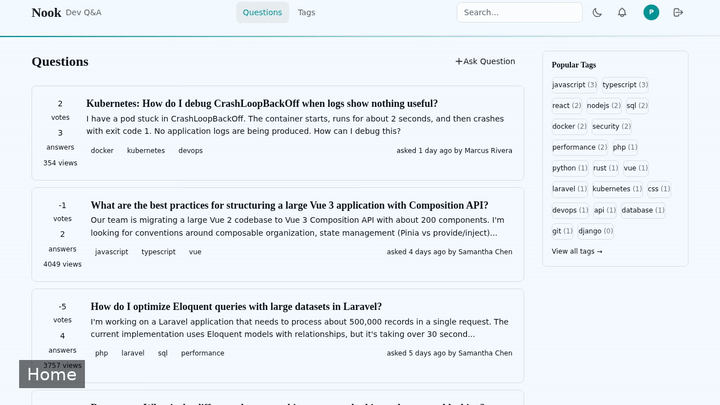
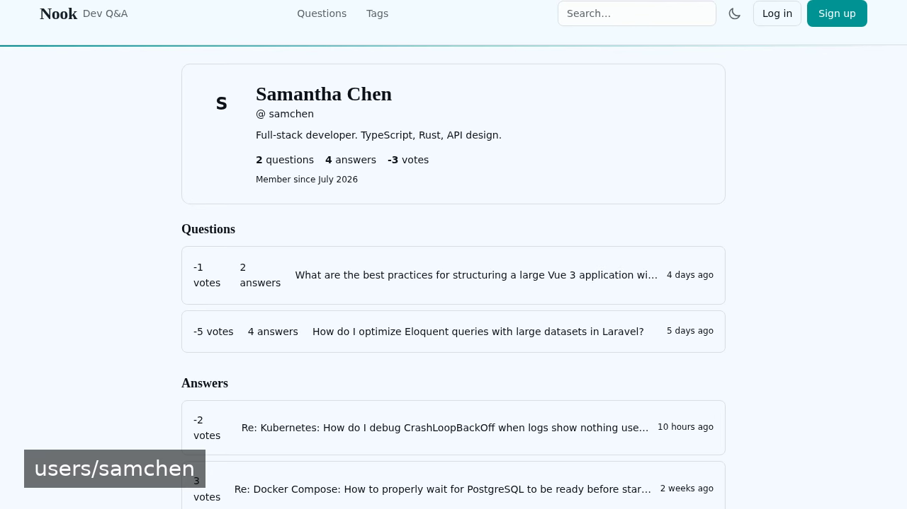
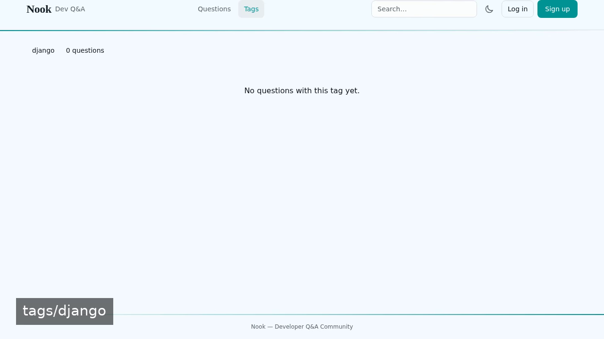

# Nook — open-source knowledge base app

**Nook** is a free, open-source knowledge base app built with V. Nook is a developer Q&A forum with core moderation flags. Run it locally, deploy it as a self-hosted knowledge base app, or [remix it on cenius.ai](https://cenius.ai/marketplace/p/nook) to make it your own — the whole application (code, design, seeded demo data) ships in this repository under the MIT license.

[](LICENSE)  [](https://cenius.ai)

## Demo



▶ **[Watch the full demo video](https://cenius.ai/marketplace/p/nook)** — the complete walkthrough, playing on the project's cenius.ai page · [MP4 file](.github/media/demo.mp4)

## Screenshots

  

## Features

- User Registration & Login
- Ask a Question
- Answer a Question
- Vote on Questions and Answers
- Accept an Answer
- Flag Content for Moderation
- Admin Moderation Dashboard
- Light/Dark Theme Toggle
- User Profile
- Search Questions

## Quick start

```bash
./install.sh   # installs dependencies + seeds demo data
```

See [`INSTALL.md`](INSTALL.md) for full setup and usage instructions.

## Usage guide

Once the application is running (see [Installation](INSTALL.md)), you can interact with it through your browser or via HTTP clients.

### Browsing the Site

Visit `http://localhost:8000` in your web browser. The application provides a responsive, light/dark themeable interface.

#### Core Features

- **Question Listing**: Browse all questions on the homepage.
- **Ask a Question**: Use the “Ask” button to submit a new question with tags.
- **View Question & Answers**: Click a question to see details, votes, and answers.
- **Answer a Question**: On a question page, write your answer and submit it.
- **Vote**: Upvote or downvote questions and answers.
- **Accept an Answer**: The question author can mark one answer as accepted.
- **Flag Content**: Report inappropriate questions or answers using the flag button.
- **Search**: Use the search bar to find questions or tags.
- **User Profile**: View user profiles with their activity.
- **Notifications**: See notifications for new answers or votes.
- **Admin Moderation**: Moderators (users with the moderator role) can manage flags at `/admin/flags`.

### API / Curl Examples

While the primary interface is web, you can also interact with the underlying HTTP endpoints if you wish (many are POST‑only, requiring CSRF tokens and authentication). Below are illustrative examples using `curl` against the development server.

#### Get list of questions

```bash
curl http://localhost:8000/questions
```

#### Create a question (requires authentication)

_Full guide: [`USAGE.md`](USAGE.md)_

## Architecture

V application, delivered as a complete, runnable project (8340 files). Top-level layout: `app/`, `bootstrap/`, `config/`, `database/`, `public/`, `resources/`, `routes/`, `storage/`. `install.sh` provisions dependencies and seeds demo data, so the app boots with something to show. Setup details live in [`INSTALL.md`](INSTALL.md).

## FAQ

### How do I self-host Nook?

Clone this repository and run `./install.sh`, then start the app as described in [`INSTALL.md`](INSTALL.md). Nook is fully self-hostable — no external services are required to try it.

### Is Nook free for commercial use?

Yes. The code is MIT-licensed — use it, modify it, and ship it commercially. See [LICENSE](LICENSE).

### Can I rebrand or white-label Nook?

Yes — and the easiest way is [remixing it on cenius.ai](https://cenius.ai/marketplace/p/nook): modifications made on the platform come with full rebrand and relicense rights over your derivative.

### How can I customize Nook without editing code?

Open it on [cenius.ai](https://cenius.ai/marketplace/p/nook) and describe the changes you want in plain English — the platform modifies the app and gives you a new, downloadable build.

### What is Nook built with?

V. The full source in this repository is exactly what the app runs.

## License & rebranding

Released under the [MIT License](LICENSE) (© 2026 Cenius AI) — free for personal and commercial use.

**Need a customized version?** [Remix this app on cenius.ai](https://cenius.ai/marketplace/p/nook) — modifications made on the platform come with **full rebrand & relicense rights** over your derivative.

## Built with cenius.ai

This entire application — code, design, seeded demo data — was generated on **[cenius.ai](https://cenius.ai)** from a plain-English description.

- 🚀 [Build your own app on cenius.ai](https://cenius.ai)
- 🎛️ [Remix Nook on the marketplace](https://cenius.ai/marketplace/p/nook) — open it in a workspace, prompt for changes, and ship your own version.

More open-source apps: [the Cenius-ai catalog](https://github.com/Cenius-ai) · [showcase index](https://github.com/Cenius-ai/showcase)
